# 2FA Backup Tools

> Back up your credentials as QR codes on paper.

Everyone should absolutely use [password managers](https://en.wikipedia.org/wiki/Password_manager) for most of their secrets. But sometimes we just have to resort to good ol' paper to back up root passphrases or 2FA recovery codes. USB keys fail at worst times, and cloud solutions still require [something the user knows](https://en.wikipedia.org/wiki/Multi-factor_authentication#Knowledge). That's what the tools in this repository are for — to [split](#-splitter) the secrets into shares (if necessary), [encode](#-encoder) them as QR codes and print them out. All offline, obviously.

```mermaid
graph LR;
  subgraph split["SPLIT (into 3 shares)"]
    source['correct horse battery staple'] -- share #1 --> share_1[801f5baf...];
    source -- share #2 --> share_2[802f769e...];
    source -- share #3 --> share_3[80302d31...];
  end
  subgraph encode["&nbsp;PRINT (QR codes)&nbsp;"]
    share_1 --> qro_1["📄"];
    share_2 --> qro_2["📄"];
    share_3 --> qro_3["📄"];
  end
  qro_1 -.- qri_1["📄"];
  qro_2 -.- qri_2["📄"];
  subgraph combine["COMBINE (2 / 3 required)"]
    qri_1 --> target['correct horse battery staple'];
    qri_2 --> target;
  end
```

See ['Where do you store your personal private GPG key?'](https://security.stackexchange.com/q/51771) for amusement and additional considerations (such as wiping the printer's memory). Remember though, there is [no absolute security](https://xkcd.com/538/).

## 👨‍👩‍👧‍👦 Splitter

> Try it at https://tfa-backup-splitter.onrender.com.

- **SPLIT** mode
  - Enter your secret into the text area.
  - Choose the overall number of shares (right slider) and the minimum number of
    shares required to restore the secret (left slider).
  - Individual shares can be copied by clicking on them.
- **COMBINE** mode
  - Enter the shares into the text area, one per line.
  - Once enough shares are entered, the secret will be shown below. 

The tool uses [Shamir's Secret Sharing](https://en.wikipedia.org/wiki/Shamir%27s_Secret_Sharing) for splitting the data.

<kbd>
  
tfa-backup-splitter.gif

  
</kbd>

## 📝 Encoder

> Try it at https://tfa-backup-encoder.onrender.com.

- Click the `+` button in the bottom right corner to add a new block.
- Enter your secret into the text area, and its label into the input field above.
  - Secrets in each block turn into QR codes on blur, and back into text on focus.
- Once all secrets are entered, click the printer button in the top right corner.

Each output page will contain 9 blocks in a grid for easy cutting.

<kbd>
  
tfa-backup-encoder.gif

  
</kbd>

## Custom deployment

You can use the button below to spin up your own instances on [render.com](https://render.com).

